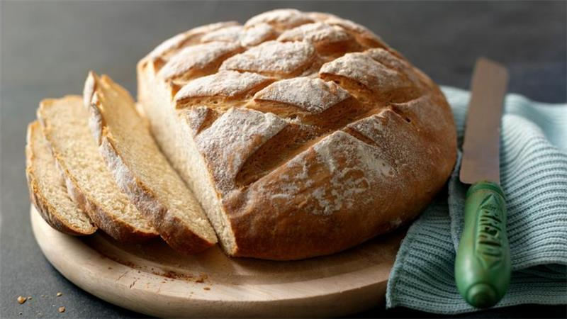

# Title <!-- omit in toc -->


- [Visual elements](#visual-elements)
  - [Bold](#bold)
  - [Italic](#italic)
  - [Quote](#quote)
  - [Code and formulas](#code-and-formulas)
    - [Code phrase](#code-phrase)
    - [Code block](#code-block)
- [Linking elements](#linking-elements)
  - [Links to content](#links-to-content)
    - [External](#external)
    - [Internal](#internal)
  - [Images](#images)
    - [External](#external-1)
    - [Internal](#internal-1)
- [Lists](#lists)
  - [Ordered list](#ordered-list)
  - [Unordered list](#unordered-list)
- [Tables](#tables)

This is the first paragraph of my file.

This is the second paragraph of my file.

This is the second paragraph of my file.  
This is the second paragraph of my file. This is the second paragraph of my file.This is the second paragraph of my file. This is the second paragraph of my file. This is the second paragraph of my file.This is the second paragraph of my file. This is the second paragraph of my file. This is the second paragraph of my file.

## Visual elements

### Bold

This is **bold** text.

### Italic

This is _italic_ text.

### Quote

This is a quote:

> This is a quote.  
> This is a quote2.

### Code and formulas

#### Code phrase

This is a text with `void` code phrase.

#### Code block

This is a code block:

```
<data name="ErrorHeader" xml:space="preserve">
<value>Error</value>
</data>
```

## Linking elements

### Links to content

#### External

Example: [Weather forecast](https://www.meteo.pl)

#### Internal

Link to file example: [Additional information](reference.md)

### Images

#### External


#### Internal




## Lists

### Ordered list

1. Point 1
1. Point 2
1. Point 3

### Unordered list

- Item 1
- Item 2
- Item 3

## Tables

| column1 | column2 | column3                    |
| ------- | ------- | -------------------------- |
| row1    | row2    | row3                       |
| row1    | row2    | lijuhlfeqiuejjjjjjjjjjjjhr |

Test sentence

